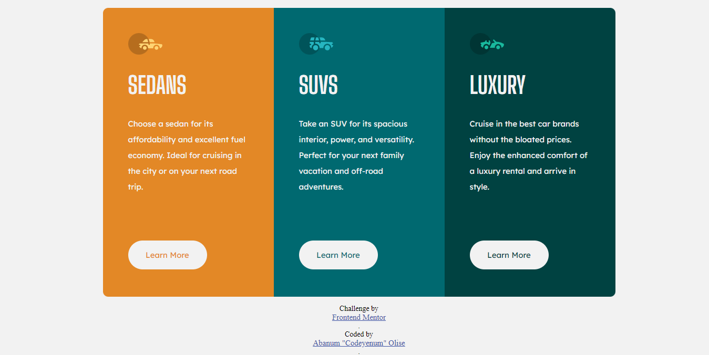

# Column-Preview-Card-Component
# Frontend Mentor - 3-column preview card component solution

This is a solution to the [3-column preview card component challenge on Frontend Mentor](https://www.frontendmentor.io/challenges/3column-preview-card-component-pH92eAR2-). Frontend Mentor challenges help you improve your coding skills by building realistic projects. 

## Table of contents

- [Overview](#overview)
  - [The challenge](#the-challenge)
  - [Screenshot](#screenshot)
  - [Links](#links)
- [My process](#my-process)
  - [Built with](#built-with)
  - [What I learned](#what-i-learned)
- [Author](#author)

## Overview

### The challenge

Users should be able to:

- View the optimal layout depending on their device's screen size
- See hover states for interactive elements

### Screenshot

### Links

- Solution URL: [Codeyenum Column-Preview-Card-Component](https://github.com/Codeyenum/Column-Preview-Card-Component)
- Live Site URL: [Column-Preview-Card-Component](https://mycolumncardpreview.netlify.app/)

## My process

### Built with

- Semantic HTML5 markup
- CSS custom properties
- CSS flex-box
- CSS hover effects
- Mobile-first workflow

### What I learned

- How to work with CSS layouts, flex-box, borders and fonts
- How to improve design responsiveness with media queries

## Author

Abanum Oliseyenum
- Github - [Codeyenum](https://github.com/Codeyenum/)
- Frontend Mentor - [@Codeyenum](https://www.frontendmentor.io/profile/codeyenum)
- Twitter - [@Olise_the_dev](https://www.twitter.com/Olise_the_dev)

